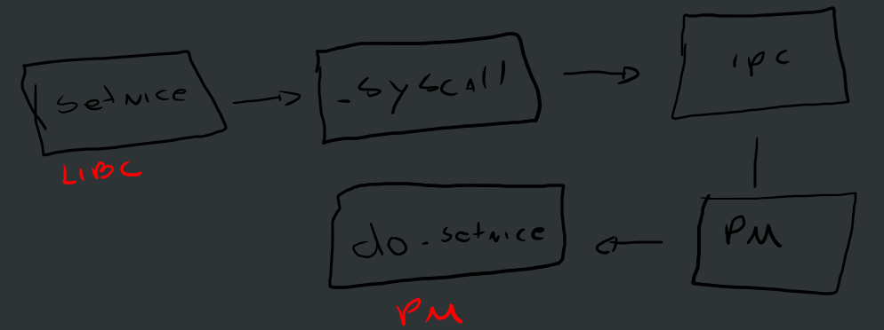

# My KB

## Build

Run `build_debug.sh` from source root folder. Here is what i does:
- Set variable JOBS to 8 - change to the number of cores in your machine
- Set BUILDVARS, adding the debug flag
- Set USR_SIZE and ROOT_SIZE so the image accommodates the new sizes after the debug compilation - the build script considers the release size for those sections.

## Run

Just run the `run.sh` command, it will start qemu using the Minix image.

## Problem Solving

## Outside the book

### Change welcome message

Just changed [boot2.c](../sys/arch/i386/stand/boot/boot2.c#L291), adding a single printf:

```c
    printf("\n ---- Version modified by edguer.\n");
```

### Chapter 2 - Processes

#### *44.  Add code to the MINIX 3 kernel to keep track of the number of messages sent from process (or task) i to process (or task) j. Print this matrix when the F4 key is hit.*

After some changes, I came to the conclusion it would be easier and cooler to change the `proc` struct and add a counter for messages sent per process at [proc.h](../minix/kernel/proc.h#L137).
1. Changed [proc.h](../minix/kernel/proc.h#L137) to add a new field.
2. Changed [proc.c](../minix/kernel/proc.c#L896) to increment the field every time a message is sent.
3. Changed [dmp_kernel.c](../minix/servers/is/dmp_kernel.c#L298) to show the field in F4 screen.

#### *45. Modify the MINIX 3 scheduler to keep track of how much CPU time each user process has had recently. When no task or server wants to run, pick the user process that has had the smallest share of the CPU.*

For part one, CPU time is already being stored at `proc`'s `p_user_time` and `p_sys_time`, and being displayed at F1 screen, at [dmp_kernel.c](../minix/servers/is/dmp_kernel.c#L348). The math is being done inside the [clock's interrupt handling process](../minix/kernel/clock.c#L116). Both fields are filled with ticks: every clock tick they are incremented. We did a change to store the time in milliseconds - MIB server has such an example [here](../minix/servers/mib/proc.c#L164). Since this could be an expensive call, we only made the math when the process is unscheduled at the [dequeue proc function](../minix/kernel/proc.c#L1800), the only difference to what MIB does is the `sys_hz()` call: apparently it can only be called from the user space, since we get segfaults if we try doing it from the kernel, so we just used the default hertz value, which is 1000 for x86.

For the second part, we tried to change the [pick_proc](../minix/kernel/proc.c#L1823) returning the `proc` found in the `proc` table, but it failed with no errors - Minix just hanged. Same happened if we tried to do it at the `switch_to_user`, and even after enqueuing the process instead of just returning it, which makes sense since the queues are cpu variables, but that did not work - Minix hangs.

To pick up a user process we have to understand how to find them, and where processes reside. First of all, there is a global process table, the `proc` array, used across the board, and there are per-cpu queues for ready processes. So when the scheduler or the kernel decides a process is ready to run, its address is added to the ready queue and then picked up later. So we need to find the processes in the global table and enqueue it, so it gets to a per-process queue.

To traverse the global process table, one can use the `BEG_PROC_ADDR`, `BEG_USER_ADDR`, and `END_PROC_ADDR` macros and read each memory location to get the `proc` structures in the list. Later, we need to make sure that the process we pick up is ready to be executed, otherwise the kernel will crash. For that, we use the `proc_is_runnable` macro, which essentially checks if the process flags are empty. If it is runnable, in theory we can enqueue it.

Even after doing all the checks, Minix hangs if we keep booking those processes. The problem might be that if we keep booking and switching processes like this, the machine will keep busy and hang?

#### *46. Modify MINIX 3 so that each process can explicitly set the scheduling priority of its children using a new system call setpriority with parameters pid and priority.*

Setting up a new system call is simple, but requires a few steps and changes in a lot of files. We opted to call it `setnice`, since `setpriority` was already being used. The draw below shows the basic flow that a syscall takes when in process manager server:



1. We must change the user library (libc) to add the function
2. The libc function calls `_syscall` function (providing the system call number), which essentially sends the message to the IPC server with `sendrec`
3. The IPC server dispatches the message to the PM server
4. The PM server reads the message number and call the appropriate function, in this case it is do_setnice.

Let's drill down on the changes...

1. The first thing we had to do was to add our function prototype to the libc header file: [unistd.h](../include/unistd.h#112)
2. Then, we had to add a system call number at [callnr.h](../minix/include/minix/callnr.h#40), notice that because we are adding one more syscall to the PM, the `NR_PM_CALLS` definition was increased by one
3. To be able to communicate with the PM, we must add our data parameters to the message. For that, we had to add a additional struct field called `m_lc_pm_setnice` containing our parameters to the `message` struct at [ipc.h](../minix/include/minix/ipc.h#2411) header. Of course we had to create a struct for our case, located at that same file at [line 532](../minix/include/minix/ipc.h#532).
4. With all that setup, we were good to create the implementation. First one was the libc function implementation, and for that we opted to create a new source file called [setnice.c](../minix/lib/libc/sys/setnice.c). We simply create the message and fill our parameters, then send it using `_syscall`, passing the PM process number and our system call number as arguments. Notice the source file must me added to the [Makefile.inc](../minix/lib/libc/sys/Makefile.inc)
5. Next step is to create the prototype for the `do_setnice` function for the PM, and this was done inside the [proto.h](../minix/servers/pm/proto.h#26) file
6. We also need to associate our system call number to the `do_setnice` function at [table.c](../minix/servers/pm/table.c#62)
7. Now we can write the `do_setnice` implementation at the PM. We did that at the [setnice.c](../minix/servers/pm/setnice.c) file. In summary, we look for that process, check if it is really child of the calling process and then just use the `sched_nice` function to change the priority and update the process entry with the new value at the PM processes' list

#### *47. Modify the hwint_master and hwint_slave macros in mpx386.s so the operations now performed by the save function are performed inline. What is the cost in code size? Can you measure an increase in performance?*

This exercise is hard to complete, since the aformentioned "save" assembly function was converted to a C macro in latest Minix version, meaning it is now inline. Performance is probably better, based on information brought by the book - it increases the assembly size, but it gets much better in performance because there is less pressure in the stack, since there is one less function call, or one less stack frame. So `pushad`, for example, is spared (pushing all registers to the stack), and going back to the parent function address is also spared. Measurements at this low level is very hard, since we don't have printf at hand, at least, and any custom logging would have a huge impact on the interrupt serving routine performance, so much noise that would hide the actual performance measurement.

#### *50. Modify MINIX 3 to collect statistics about messages sent by whom to whom and write a program to collect and print these statistics in a useful way.*

The easiest place to get source and destination process is in [`mini_send` function](../minix/kernel/proc.c#871), it is a kernel-level function, but contains the `caller_ptr` and the `dst_ptr` pointers, so we can log them here.

This is in kernel space though, so we will need a way to transmit that data to the user-space. For that though we would need to go deep into the kernel, here is how it works: whenever we need kernel information, we need to call the `sys_getinfo` function, which calls the `_kernel_call` that, in the end, calls the `_do_kernel_call_intr` assembly routine, That routine simply pushes the message address to EAX and call the kernel software interrupt. At some point during interrupt handling, the `kernel_call` will get called and route the to the appropriate handler through the `call_vec`, which will take us to the `do_getinfo` handler at [do_getinfo.c](../minix/kernel/system/do_getinfo.c#74). So after adding having our data collected, we need to implement a new GETINFO type.


**Implementation**

Made a simplistic implementation with a matrix. It will consume 4MB in memory, and there is no cleanup logic when a process is finished, it is very dumb. First, we defined the `send_msg_counter` matrix at [proc.h](../minix/kernel/proc.h#294) and added the `proc_index` macro to make it easier to find a process address based on the process struct at [proc.h](../minix/kernel/proc.h#274). Next, we are zeroing the matrix at startup at [proc.c](../minix/kernel/proc.c#142) and increase the counter in `mini_send` method at [proc.c](../minix/kernel/proc.c#896).

Then comes the hardest part: making a way to copy the kernel level data to Information Server process. This is done by using the `sys_getinfo`, so we first we created our own macro at [syslib.h](../minix/include/minix/syslib.h#193), and its SYS_GETINFO number at [com.h](../minix/include/minix/com.h#340). To handle the request, we did changes at [do_getinfo.c](../minix/kernel/system/do_getinfo.c#203).

To call and the kernel info, we created our own matrix at the IS at [dmp_kernel.c](../minix/servers/is/dmp_kernel.c#58) and made changes to our dump function at [dmp_kernel.c](../minix/servers/is/dmp_kernel.c#379). Unfortunately, the information retrieved from the kernel is always empty, and zeroed, although the result is always OK. We can see the table is being filled by looking at the kernel level printf, but the data is not being copied over to the IS process.

Another approach would be adding a list inside each process's entry, so we would take advantage of all the data copy already in-place.

### Chapter 3 - Input and Output

Before anything elase, we must learn how to write a driver to Minix 3, so I followed this walkthrough: https://wiki.minix3.org/doku.php?id=developersguide:driverprogramming

They can be found under minix/drivers/hello (the simplest), minix/drivers/hello-dev (character device with SEF API) and minix/drivers/rtc (to get RTC/CMOS date time, also character device).

#### *40. Write a graphics driver for the IBM color display, or some other suitable bitmap display. The driver should accept commands to set and clear individual pixels, move rectangles around the screen, and any other features you think are interesting. User programs interface to the driver by opening /dev/graphics and writing commands to it.*

Writing this would be a big challenge, so I'm planning to write 2 versions of it:
1. A simple character driver that reads from a virtual char device and sets the bios video memory accordingly - it should strait forward, except we need to understand how to get access to the video memory (it can probably be done through the conf file).
2. Write the actual driver for the color display, for that we would need to define what hardware we should use (is it a generic VGA interface?) gather hardware manuals, emulate the hardware in Virtual Box and implement.

*UPDATE:* turned out, the IBM color simply translates to the colored character video memory block (the one that carries 2 bytes per character, one for the char itself, and other for the color), so we just need to write a driver that sets that memory location.

To make that happen, we created a driver called "vid" - regular process, pretty much a copy from other devices in terms of structure etc. By digging into other drivers and other parts of Minix, I figured that for us to get access to the video memory location, we need to create an "mmap", or memory map. Kernel gives as a way of doing it with the `vm_map_phys` call, in which you pass the memory address you and size you need to make the map. Then, you get a pointer to that memory location and you can freely manipulate it. Problem is, before that, you have to actually request the privilege for that memory address by calling `sys_privctl`, which requires a `minix_mem_range`. So, after calling `sys_privctl` and `vm_map_phys` you will get hold of that magic pointer.

Today we are just receiving some chars from the device, and then print them on the screen on the first character of each row, so we can actually see the effect in the screen, since we are writing to it at the same time as the console driver, so our changes get overwriting every time. For example: by the time we write to the driver, Minix logs the kernel logs into the screen, overwriting our changes to the video memory.

The memory mapping part can be found [here](../minix/drivers/vid/vid.c#115), and the writing part [here](../minix/drivers/vid/vid.c#164).

Next steps: flush the screen before writing (memset would do) so we can see the data better.

#### *41. Modify the MINIX floppy disk driver to do track-at-a-time caching.*

#### *42. Implement a floppy disk driver that works as a character, rather than a block device, to bypass the file system’s block cache. In this way, users can read large chunks of data from the disk, which are DMA’ed irectly to user space, greatly improving performance. This driver would primarily be of interest to programs that need to read the raw bits on the disk, without regard to the file system. File system checkers fall into this category.*

#### *43. Implement the UNIX PROFIL system call, which is missing from MINIX .*

#### *44. Modify the terminal driver so that in addition to a having a special key to erase the previous character, there is a key to erase the previous word.*

#### *45. A new hard disk device with removable media has been added to a MINIX 3 system. This device must spin up to speed every time the media are changed, and the spin up time is quite long. It is anticipated media changes will be made frequently while the system is running. Suddenly the waitfor routine in at wini.c is unsatisfactory. Design a new waitfor routine in which, if the bit pattern being awaited is not found after 1 second of busy waiting, a phase will be entered in which the disk driver will sleep for 1 second, test the port, and go back to sleep for another second until either the sought for pattern is found or the preset TIMEOUT period expires.*